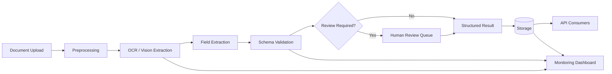

# DocOps AI: Document Intelligence MVP

DocOps AI is a production-style document intelligence starter project. It extracts structured fields from scanned receipts and document images using OCR, validates the output with Pydantic, and routes low-confidence cases to a human review queue.

## Why This Project Matters

This project demonstrates real AI/ML engineering skills beyond a basic chatbot:

- OCR pipeline design
- Document preprocessing
- Structured information extraction
- Pydantic schema validation
- FastAPI model-serving API
- Streamlit review interface
- Dockerized deployment
- CI testing with GitHub Actions
- Human-in-the-loop workflow design

## Current MVP Features

- Upload image document
- Run OCR with Tesseract
- Extract fields using rule-based baseline
- Validate JSON schema with Pydantic
- Assign confidence score
- Route incomplete or low-confidence documents to review queue
- Serve backend through FastAPI
- Display results in Streamlit UI

## Tech Stack

- Python
- FastAPI
- Streamlit
- Tesseract OCR
- OpenCV
- Pydantic
- Docker
- pytest
- GitHub Actions

## Project Structure

```text
docops-ai-document-intelligence/
├── src/
│   ├── api/
│   ├── preprocessing/
│   ├── extraction/
│   ├── review/
│   └── utils/
├── ui/
├── tests/
├── docs/
├── data/
├── Dockerfile
├── docker-compose.yml
├── requirements.txt
├── Makefile
└── README.md
```

## Local Setup

### 1. Clone Repository

```bash
git clone https://github.com/your-username/docops-ai-document-intelligence.git
cd docops-ai-document-intelligence
```

### 2. Create Virtual Environment

```bash
python -m venv .venv
source .venv/bin/activate
```

### 3. Install System Dependency

macOS:

```bash
brew install tesseract poppler
```

Ubuntu:

```bash
sudo apt-get update
sudo apt-get install -y tesseract-ocr poppler-utils
```

### 4. Install Python Dependencies

```bash
pip install -r requirements.txt
```

## Run API

```bash
make api
```

Open:

```text
http://localhost:8000/docs
```

## Run Streamlit UI

In another terminal:

```bash
make ui
```

Open:

```text
http://localhost:8501
```

## Run with Docker

```bash
docker compose up --build
```

API:

```text
http://localhost:8000/docs
```

UI:

```text
http://localhost:8501
```

## Run Tests

```bash
make test
```

## Sample API Usage

```bash
curl -X POST "http://localhost:8000/api/v1/extract" \
  -H "accept: application/json" \
  -H "Content-Type: multipart/form-data" \
  -F "file=@data/samples/sample_receipt.png"
```

## Visual Artifacts to Add to Project One

The following artifacts should be included in the project submission to make the workflow, model behavior, and operational readiness easy to understand.

### System Architecture Diagram



This diagram should show the end-to-end path from upload through preprocessing, extraction, validation, review queue, storage, API access, and monitoring.

### Annotated Document Screenshot

Add a screenshot at `docs/assets/annotated-document.png` showing one parsed receipt or form with bounding boxes or highlighted source spans for extracted fields such as vendor, date, total, tax, and line items.

Recommended annotations:

- Green boxes for high-confidence extracted fields
- Yellow boxes for fields that need review
- A side panel showing extracted JSON values and confidence scores

### Model Benchmark Table

| Model | Quality | Latency | Abstention Behavior | Best Use |
| --- | --- | --- | --- | --- |
| OCR baseline | Good for clean receipts with predictable layouts | Low | Abstains when required fields are missing or confidence is below threshold | MVP baseline and explainable fallback |
| LayoutLMv3 | Strong on layout-aware forms and semi-structured documents | Medium | Can abstain using field confidence and schema validation failures | Forms with consistent spatial structure |
| Donut | Strong for OCR-free document parsing when fine-tuned | Medium to high | Abstains when generated JSON is invalid or confidence is low | Noisy scans and documents where OCR struggles |
| Qwen2.5-VL | Strong general visual reasoning and flexible extraction | High | Abstains when answer confidence is low, evidence is missing, or schema checks fail | Complex documents and exception handling |

### Monitoring Dashboard Screenshot

Add a screenshot at `docs/assets/monitoring-dashboard.png` showing operational metrics for:

- Review rate
- Schema failure rate
- Field confidence drift
- End-to-end extraction latency

The dashboard should make it clear when the system is healthy, when model quality is drifting, and when more documents are being routed to human review.

### Short Demo Video

Add a short demo video at `docs/assets/demo.mp4` or link to a hosted recording. The demo should show:

- One successful parse where the uploaded document returns validated structured JSON
- One exception case where missing, ambiguous, or low-confidence fields are routed to the human review queue

## Roadmap

- Add PDF upload support
- Add MLflow tracking
- Add LayoutLMv3 model baseline
- Add Donut OCR-free extraction
- Add Qwen2.5-VL document question answering
- Add human correction UI
- Add monitoring dashboard
- Add cloud deployment


