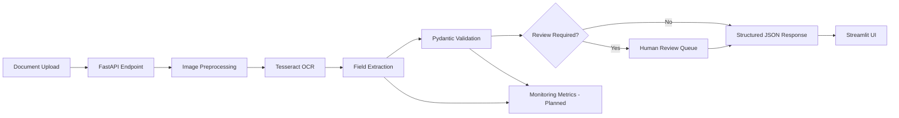

# DocOps AI: Document Intelligence MVP

I built **DocOps AI** as an end-to-end document intelligence project for extracting structured data from scanned receipts and document images. The project combines OCR, preprocessing, rule-based field extraction, schema validation, confidence scoring, and a human review workflow so that low-confidence or incomplete extractions are not treated as final results.

The goal of this project is to show a practical AI/ML engineering workflow beyond a simple chatbot: model-serving API design, validation, observability planning, review routing, testing, containerization, and a lightweight user interface.

## Project Highlights

- Built a FastAPI backend for document upload and structured extraction
- Implemented OCR-based text extraction with Tesseract
- Added image preprocessing utilities using OpenCV
- Designed a Pydantic schema for validated document outputs
- Added confidence scoring and review-required logic
- Routed incomplete or low-confidence documents to a human review queue
- Built a Streamlit UI for uploading documents and viewing extracted results
- Added Docker, Docker Compose, pytest tests, and GitHub Actions CI

## Problem I Solved

Manual invoice and receipt processing is slow, repetitive, and error-prone. My MVP focuses on the core production pattern used in document AI systems:

1. Accept an uploaded document image.
2. Clean and prepare the image for OCR.
3. Extract raw text.
4. Convert text into structured fields.
5. Validate the output against a strict schema.
6. Route uncertain results to a review queue.
7. Return usable JSON through an API and UI.

## Current MVP Features

- Upload `png`, `jpg`, `jpeg`, `tiff`, or `bmp` document images
- Extract OCR text from uploaded documents
- Parse receipt-style fields such as vendor, date, subtotal, tax, total, and line items
- Validate extracted values with Pydantic
- Generate a confidence score for the extraction
- Mark documents for review when required fields are missing or confidence is low
- Store review-required cases in a review queue
- Display structured JSON and raw OCR text in the Streamlit app
- Expose a health check and extraction endpoint through FastAPI

## Tech Stack

| Area | Tools |
| --- | --- |
| Backend API | Python, FastAPI, Uvicorn |
| UI | Streamlit |
| OCR | Tesseract |
| Image Processing | OpenCV |
| Validation | Pydantic |
| Testing | pytest |
| DevOps | Docker, Docker Compose, GitHub Actions |

## System Architecture



## API Endpoints

| Method | Endpoint | Description |
| --- | --- | --- |
| `GET` | `/api/v1/health` | Returns API health status |
| `POST` | `/api/v1/extract` | Accepts an image file and returns validated structured document data |

## Project Structure

```text
docops-ai-document-intelligence/
├── .github/workflows/        # CI workflow
├── data/                     # Sample and local data folders
├── docs/                     # Architecture and model documentation
├── src/
│   ├── api/                  # FastAPI app and routes
│   ├── extraction/           # OCR, field extraction, schema validation
│   ├── preprocessing/        # Image and PDF preprocessing utilities
│   ├── review/               # Human review queue logic
│   └── utils/                # Shared utilities
├── tests/                    # pytest test suite
├── ui/                       # Streamlit frontend
├── Dockerfile
├── docker-compose.yml
├── Makefile
├── requirements.txt
└── README.md
```

## Local Setup

### 1. Clone the Repository

```bash
git clone https://github.com/Kashyap-84/docops-ai-document-intelligence.git
cd docops-ai-document-intelligence
```

### 2. Create a Virtual Environment

```bash
python -m venv .venv
source .venv/bin/activate
```

### 3. Install System Dependencies

macOS:

```bash
brew install tesseract poppler
```

Ubuntu:

```bash
sudo apt-get update
sudo apt-get install -y tesseract-ocr poppler-utils
```

### 4. Install Python Dependencies

```bash
pip install -r requirements.txt
```

## Run the Project

Start the FastAPI backend:

```bash
make api
```

Open the API docs:

```text
http://localhost:8000/docs
```

Start the Streamlit UI in another terminal:

```bash
make ui
```

Open the UI:

```text
http://localhost:8501
```

## Run with Docker

```bash
docker compose up --build
```

Services:

```text
FastAPI:   http://localhost:8000/docs
Streamlit: http://localhost:8501
```

## Run Tests

```bash
make test
```

## Sample API Request

```bash
curl -X POST "http://localhost:8000/api/v1/extract" \
  -H "accept: application/json" \
  -H "Content-Type: multipart/form-data" \
  -F "file=@data/samples/sample_receipt.png"
```

## Example Output Schema

```json
{
  "document_type": "receipt",
  "vendor_name": "Sample Store",
  "invoice_number": null,
  "transaction_date": "2026-04-30",
  "subtotal": 24.99,
  "tax": 2.06,
  "total": 27.05,
  "currency": "USD",
  "line_items": [],
  "raw_text": "...",
  "confidence": 0.82,
  "review_required": false,
  "review_reasons": []
}
```

## Visual Artifacts for Project Presentation

These are the visual assets I plan to include with the project presentation or demo.

### Annotated Document Screenshot

Planned file: `docs/assets/annotated-document.png`

This screenshot will show one parsed receipt or form with bounding boxes or highlighted source spans for extracted fields such as vendor, date, tax, total, and line items.

Recommended annotation style:

- Green boxes for high-confidence extracted fields
- Yellow boxes for fields that require review
- Side panel with extracted JSON values and confidence scores

### Model Benchmark Comparison

| Model | Quality | Latency | Abstention Behavior | Best Use |
| --- | --- | --- | --- | --- |
| OCR baseline | Good for clean receipts with predictable layouts | Low | Abstains when required fields are missing or confidence is below threshold | MVP baseline and explainable fallback |
| LayoutLMv3 | Strong on layout-aware forms and semi-structured documents | Medium | Can abstain using field confidence and schema validation failures | Forms with consistent spatial structure |
| Donut | Strong for OCR-free document parsing when fine-tuned | Medium to high | Abstains when generated JSON is invalid or confidence is low | Noisy scans and OCR-challenging documents |
| Qwen2.5-VL | Strong general visual reasoning and flexible extraction | High | Abstains when evidence is missing, confidence is low, or schema checks fail | Complex documents and exception handling |

### Monitoring Dashboard Screenshot

Planned file: `docs/assets/monitoring-dashboard.png`

The dashboard will track:

- Review rate
- Schema failure rate
- Field confidence drift
- End-to-end extraction latency

### Demo Video

Planned file: `docs/assets/demo.mp4`

The demo will show:

- One successful document parse that returns validated structured JSON
- One exception case where missing or low-confidence fields are routed to human review

## Future Improvements

- Add PDF upload support
- Add MLflow experiment tracking
- Add LayoutLMv3 as a layout-aware extraction baseline
- Add Donut for OCR-free document parsing
- Add Qwen2.5-VL for visual document question answering and JSON extraction
- Add a human correction UI for review queue items
- Add monitoring dashboard for drift, failure rate, review rate, and latency
- Deploy the API and UI to a cloud environment

## What I Learned

This project helped me practice building a realistic AI application pipeline where extraction accuracy is only one part of the system. I also focused on validation, error handling, human review, testing, and operational readiness, which are important for using AI in real document workflows.

