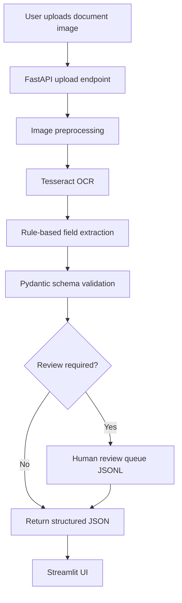

# Architecture

## MVP Design

This first version focuses on a transparent baseline:

- OCR using Tesseract
- Rule-based field extraction
- Pydantic validation
- Review queue for low-confidence or incomplete outputs
- FastAPI backend
- Streamlit frontend

## Future Enhancements

- LayoutLMv3 for layout-aware extraction
- Donut for OCR-free document parsing
- Qwen2.5-VL for visual question answering and JSON extraction
- MLflow experiment tracking
- Evidently monitoring
- Human correction feedback loop
